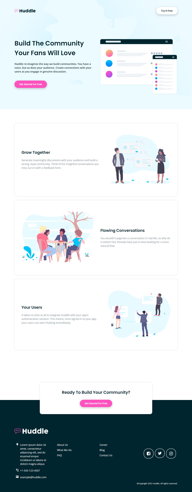
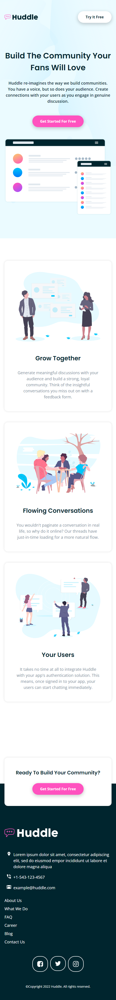

# Frontend Mentor - Huddle landing page with alternating feature blocks solution

This is a solution to the [Huddle landing page with alternating feature blocks challenge on Frontend Mentor](https://www.frontendmentor.io/challenges/huddle-landing-page-with-alternating-feature-blocks-5ca5f5981e82137ec91a5100). Frontend Mentor challenges help you improve your coding skills by building realistic projects. 

## Table of contents

- [Overview](#overview)
  - [The challenge](#the-challenge)
  - [Screenshot](#screenshot)
  - [Links](#links)
- [My process](#my-process)
  - [Built with](#built-with)
  - [What I learned](#what-i-learned)
  - [Useful resources](#useful-resources)
- [Author](#author)


## Overview

### The challenge

Users should be able to:

- View the optimal layout for the site depending on their device's screen size
- See hover states for all interactive elements on the page

### Screenshot

Desktop View





Mobile View





### Links

- Solution URL: [Github Repo](https://github.com/GentryHQ/huddle-alternating-section-LP)
- Live Site URL: [GitHub Pages](https://gentryhq.github.io/huddle-alternating-section-LP/)

## My process

### Built with

- Semantic HTML5 markup
- CSS custom properties
- Flexbox
- CSS Grid
- Mobile-first workflow
- SASS/SCSS


### What I learned

- I really enjoined working on this project with SCSS, this is my second project working with it and I feel myself improving.

- I learnt the proper way to use media queries with SASS. In my previous project (my first project) with SASS, styles at media queries were not working without the use of ```!important```. In the project, I was able to fix that.


### Useful resources

- Stack OverFlow - Can't actually find a link. In one of the answers, I got an insight as to why my media queries are not working without ```!important```


## Author

- Website - [Gentry.com.ng](https://www.gentry.com.ng)
- Frontend Mentor - [@GentryHQ](https://www.frontendmentor.io/profile/GentryHQ)
- Twitter - [@iam_gentry](https://www.twitter.com/iam_gentry)

